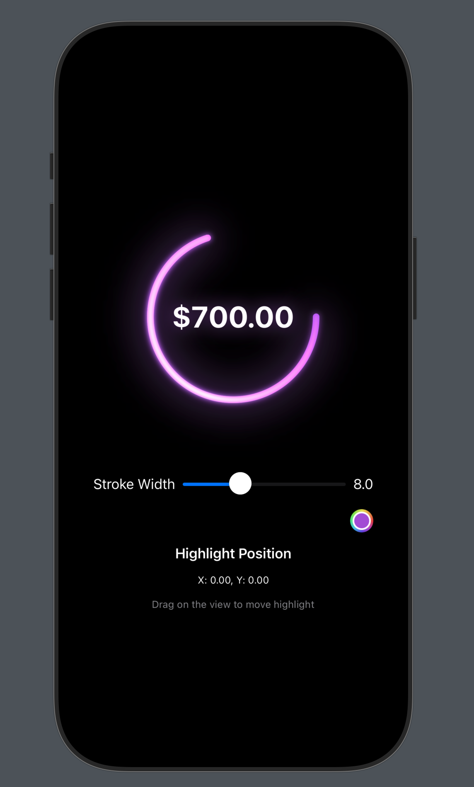
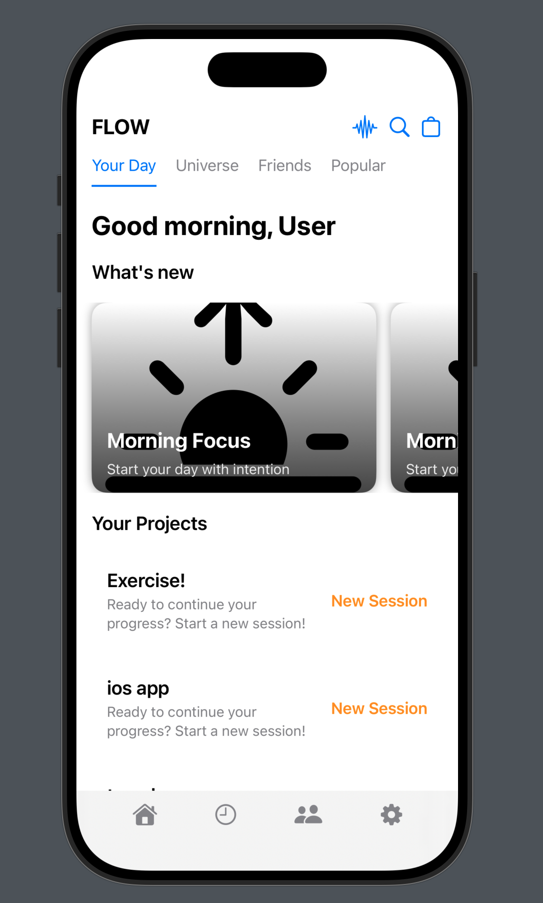
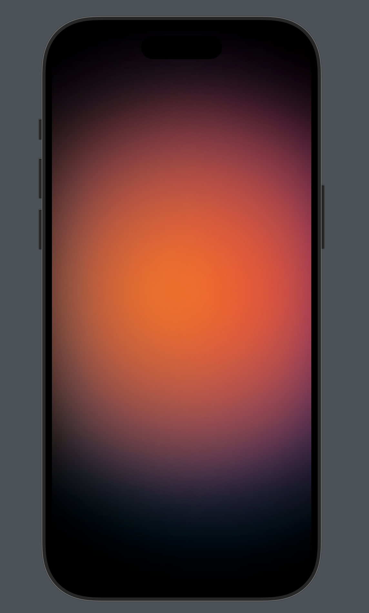

# iOS Bangers 🔥

A collection of stunning iOS UI components and effects built with SwiftUI.

## Components

### Neon Glow Effects

    
    
    

Interactive neon glow effects with customizable:
- Stroke width
- Glow color
- Highlight position
- Touch interaction

### Mesh Gradients

Beautiful animated mesh gradients with:
- Smooth animations
- Customizable colors
- Performance optimized
- Metal shader implementation

## Getting Started

1. Clone the repository
2. Open the project in Xcode
3. Build and run!

## Requirements

- iOS 16.0+
- Xcode 15.0+
- Swift 5.9+

## License

This project is available under the MIT license. See the LICENSE file for more info.
